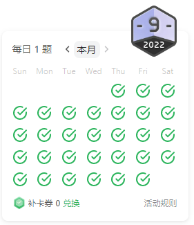
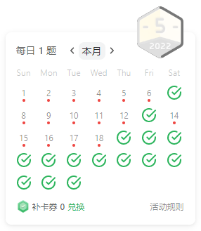

# Leetcode Every Day, hope me getting better.

TimeLine

20221204

The 200th days

202211

202210

20221024

202209

20220924

Done the Algorithm Basics learn

20220905

Today, I will getting start to do Algorithmic Basics learn.

20220902

Participate in the Grape City Algorithm Challenge. Easy and Middle question is fine 👍, but the hard level is not Ok 😒, Just keep it up, the level hard will solved by me 👨‍💻.

202208

2020826

The 100th Day, Keep going.

20220821

Some thing wrong.... fake aug 6 again again

20220820

Github bugs, Should add a fake Aug 6 commit.

202207

202206

202205

